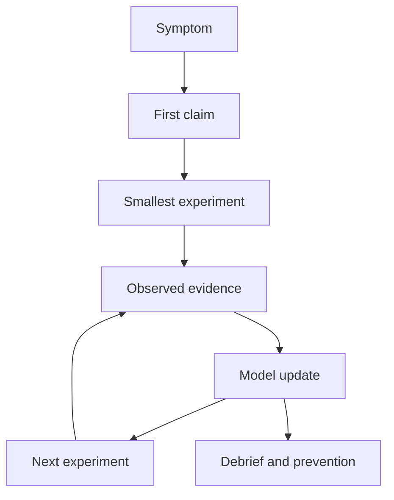

# Debugging Apprenticeship Rewrite Design

## Decision

Rewrite the repository as **Debugging Apprenticeship: C Investigations Through Mentor Dialogue**.

The project remains C/debugging-specific, but the learning mode changes from a self-directed tool curriculum to a mentor-led apprenticeship. Each week becomes a guided investigation where the learner states hypotheses, runs focused experiments, interprets evidence, and defends the next move.

## Problem

The current repository teaches useful debugging tools, but its default shape is instructional: read concepts, run commands, complete practice, and check understanding. The new goal is discussion-first learning. The repo should make debugging feel like a conversation between a mentor and an apprentice, where the central skill is reasoning from evidence rather than passively following tool steps.

## Audience

Primary audience: a learner working with a mentor.

Secondary audiences:

- A solo learner who can answer the mentor prompts in writing.
- A study group where one person plays the mentor role.
- A reviewer evaluating whether the learner's debugging reasoning is improving.

## Scope

Rewrite the top-level documentation and all ten weekly README files.

Add shared guidance files:

- `mentor-guide.md`
- `learner-guide.md`
- `investigation-template.md`
- `discussion-rubric.md`

Preserve the existing `example/` directories as raw investigation material unless a specific example no longer supports the new week narrative. The examples are valuable because they let the mentor ask evidence-based questions against real C programs.

Compiled binaries should not be treated as curriculum source. If tracked, they should be removed from source control in the implementation phase and regenerated by `make`.

## Out of Scope

- Replacing the C focus with a language-agnostic debugging course.
- Building a web app, LMS, or interactive runner.
- Adding automated grading.
- Rewriting all C examples unless a week cannot support the new dialogue structure.
- Preserving old explanatory prose for its own sake.

## Repository Shape

```text
Debugging/
├── README.md
├── mentor-guide.md
├── learner-guide.md
├── investigation-template.md
├── discussion-rubric.md
├── Week-01-Symptoms-Inputs-Claims/
│   ├── README.md
│   └── example/
├── Week-02-Runtime-State/
│   ├── README.md
│   └── example/
├── Week-03-Causality/
│   ├── README.md
│   └── example/
├── Week-04-Postmortem-Evidence/
│   ├── README.md
│   └── example/
├── Week-05-Ownership-Lifetime/
│   ├── README.md
│   └── example/
├── Week-06-Runtime-Checks/
│   ├── README.md
│   └── example/
├── Week-07-Nondeterminism-1/
│   ├── README.md
│   └── example/
├── Week-08-Nondeterminism-2/
│   ├── README.md
│   └── example/
├── Week-09-Signals-Observability/
│   ├── README.md
│   └── example/
└── Week-10-Full-Investigation/
    ├── README.md
    ├── playbooks.md
    └── example/
```

## Weekly Pattern

Every week should follow the same discussion-first structure:

```md
# Week N - <theme>

## Investigation

Short scenario describing the symptom, available files, and constraint.

## Mentor Opening

Questions asked before touching tools.

## First Claim

The learner states a hypothesis, confidence level, and what would disprove it.

## Evidence Round 1

Commands framed as experiments, not rote steps.

## Mentor Interruption

Questions that force interpretation of output.

## Evidence Round 2

A narrower experiment based on what changed.

## Debrief

Root cause, false leads, signal vs noise, and prevention.

## Apprentice Notes

Short written answers the learner must leave behind.

## Mentor Rubric

What strong answers include and what weak answers miss.
```

## Week Map

| Week | Theme | Apprenticeship Focus |
|---|---|---|
| 1 | Foundations | Turn symptoms into testable hypotheses. |
| 2 | GDB fundamentals | Choose useful breakpoints and inspect runtime state. |
| 3 | Advanced GDB | Trace causality through state changes. |
| 4 | Core dumps | Preserve and interpret postmortem evidence. |
| 5 | Valgrind | Reconstruct ownership and lifetime from reports. |
| 6 | Sanitizers | Use precise runtime failures to narrow undefined behavior. |
| 7 | Data races | Separate nondeterminism from evidence. |
| 8 | Deadlocks and live debugging | Inspect blocked systems without making them worse. |
| 9 | Logging and observability | Debug through external signals instead of stopping the program. |
| 10 | Capstone | Run a full investigation and defend the postmortem. |

## Writing Style

The new prose should be direct and conversational.

Prefer:

- "What would make this theory false?"
- "What did this command prove?"
- "What are you still assuming?"
- "Which signal is strongest?"

Avoid:

- Long textbook explanations before the learner has observed anything.
- Tool tours disconnected from a symptom.
- Prompts that accept vague answers like "GDB showed the bug."

Each prompt should push the learner toward a concrete claim with evidence.

## Data Flow



## Verification

Because this is a documentation-heavy rewrite, verification should focus on consistency and usability:

- `git diff --check`
- every week has the required sections
- top-level README links to every shared guide and week
- no unresolved placeholder markers
- no accidental deletion of useful example source files
- tracked compiled binaries are identified and either removed or explicitly deferred

If examples are modified, run the relevant `make` target inside that week.

## Risks

The main risk is making the curriculum too abstract. The rewrite must keep real commands and real evidence in every week. The mentor-dialogue structure should not become generic reflection; it should remain anchored in C programs, debugger output, sanitizer reports, traces, and logs.

The second risk is mixing old and new voices. Each weekly README should be rewritten as a coherent apprenticeship module rather than patched with prompts around old textbook prose.

## Approved Direction

The user approved the mentor-led apprenticeship direction on 2026-05-18 and explicitly said they do not care if none of the old prose remains.
